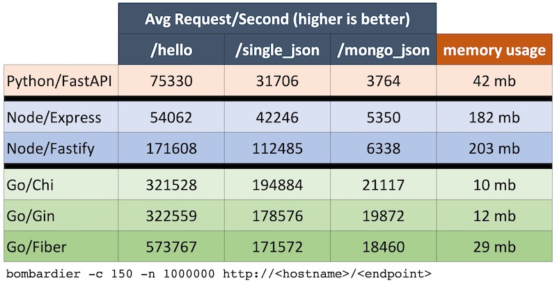

# Go vs Node vs Python - Web Benchmark

This repository implements the same web service using Go, Javascript (Node) and Python, with their most common web frameworks.

The goal is simple: see how much requests each service can handle, but not only in a "hello world" response, but in scenarios that are more common for a backend application, such as json reponses and query a database. To do this, each service has three endpoints:

### /hello
Return a simple "hello world" response text.
Expected result: the fastest endpoint, as it only return a string "hello world".

### /single_json
Return a average sized json object. 

The goal here is to see the capabilities of each langague/framework to deal with json response.
Expected result: Slower them the previous endpoint, as it need to parse a json file and attach to response.

### /mongo_json
Return 10 rows of the same json object as the previous endpoint.

The goal here is to see how the driver/connector implementation influences the number of requests per second.

Expected result: Slower them the previous endpoint, as it need to query the database (find all), convert to json, and attach to response.


## Tools and frameworks

Machine: CPU AMD Ryzen 2700x 8C/16T and 16 GB Ram.

Golang
mongo connector: go-mongodb
routers: chi, chi and fiber.

NodeJs
mongo connector: mongoose
routers: express and fastify

Python
mongo connector: pymongo
router: fastapi
runner: gunicorn

## Results

It was used bombardier tool to perform the multiple requests.

```bash
bombardier -c 150 -n 1000000 http://localhost:8000/mongo_json
```

Node.js and Python were started with 16 workers to use the full cores available.

Go was started in the standard mode (go run cmd/main.go) as it is not necessary to do anything to use all cores.




## Discussion

All languages has a drop in performance as the response payload get more complex.

As it can be seen, the results are inversely proportional with the complexity of the code.

Python is the slowest, but the code is cleaner and has fewer lines of code.

In other hand, Go is the fastest, but the code is more verbose and has more lines of code.